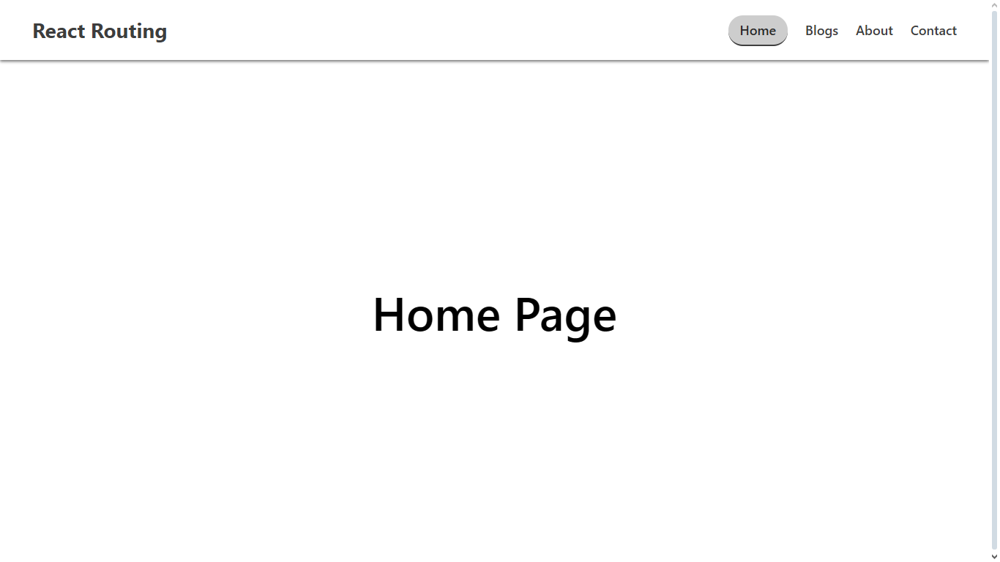
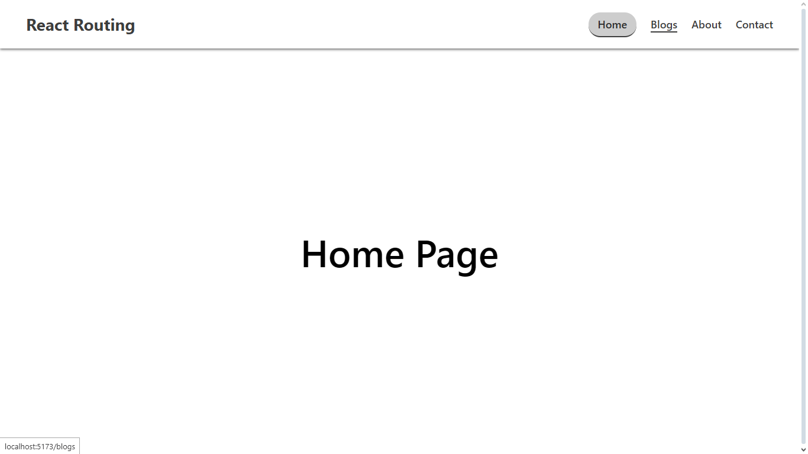
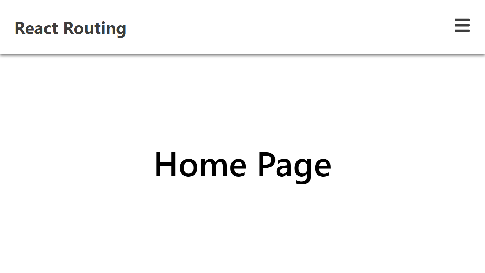
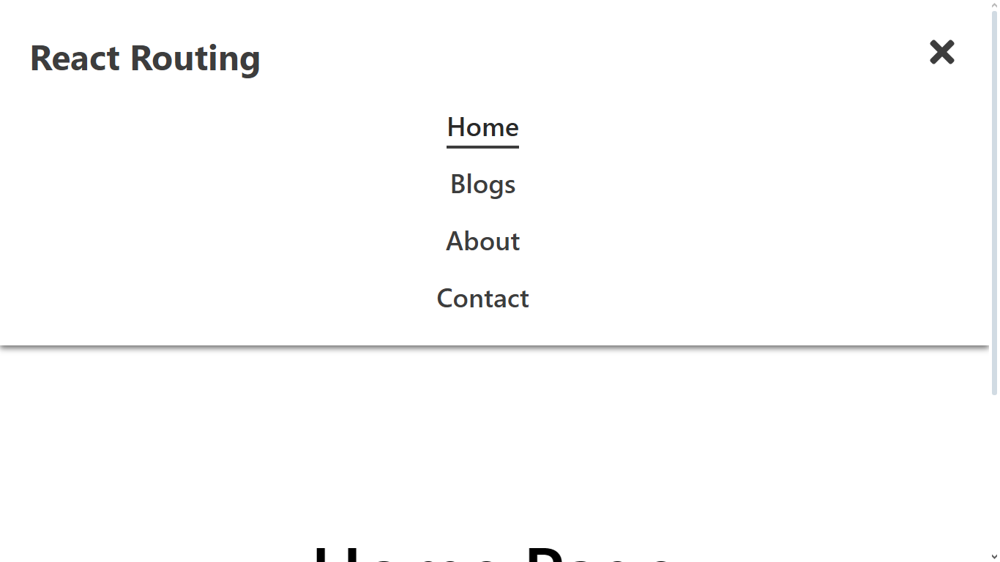

# React - Basic Routing

A simple, responsive React routing demo using **React Router v7**, **React Icons**, and **Vite**. This project demonstrates the basics of SPA navigation with an adaptive header featuring a hamburger menu for mobile responsiveness.

## 🧠 Features

- React 19 + Vite 6 powered setup

- Client-side routing with React Router v7

- Fully responsive header with mobile hamburger menu

- Active link styling & hover effects

- Modern UI with flexbox & media queries

- Optimized for development with ESLint and hot reload

## 📁 Project Structure

```bash
basic-routing/
├── public/
├── src/
│ ├── components/
│ │ └── Header.jsx      # Responsive header with hamburger menu
│ ├── pages/
│ │ ├── Home.jsx
│ │ ├── Blogs.jsx
│ │ ├── About.jsx
│ │ └── Contact.jsx
│ ├── App.css           # App styles
│ ├── App.jsx           # Main app with routes
│ ├── index.css         # Global styles
│ └── main.jsx          # Entry point
├── index.html
├── package.json
└── vite.config.js
```

## 🚀 Getting Started

### 1. Clone the repo

```bash
git clone https://github.com/himanshumaurya0007/MERN_Projects.git
cd MERN_Projects/basic-routing
```

### 2. Install dependencies

```bash
npm install
```

### 3. Start the developement server

```bash
npm run dev
```

The app should now be running at `http://localhost:5173`.

## 🛠️ Technologies Used

- React 19

- React Router DOM v7

- React Icons v5

- Vite 6

- CSS Flexbox & Media Queries

- ESLint for linting

## 🎨 Responsive Header

The responsive header supports:

- Dynamic toggle using hamburger (FaBars) and close (FaTimes) icons

- Nav menu auto-closes on link click

- Mobile-friendly design with clean animations

```bash
import { FaBars, FaTimes } from 'react-icons/fa';
```

The logic is handled via:

```bash
const [isOpen, setIsOpen] = useState(false);
```

Icons toggle based on isOpen, and styles adjust with media queries under 768px.

## 📷 Screenshots

- Home - Desktop (Active)


- Home - Desktop (Active and Hover)


- Home - Mobile


- Home - Mobile (Hamburger Menu)


## 📌 Future Scope/Improvements

- Add transitions to mobile menu

- Unit testing with React Testing Library

- Dark mode support

## 📜 License

This project is licensed under the MIT License.

## 🙋‍♂️ Author

**Himanshu Maurya** - *Full-stack MERN Developer*

📍 Badlapur, Mumbai, India

🏆 Winner – HackWave Hackathon 2024

📧 [himanshumaurya7781@gmail.com](mailto:himanshumaurya7781@gmail.com)

🔗 [LinkedIn](www.linkedin.com/in/himanshumaurya0007)

## 🧠 Learnings

- Deep understanding of React Router v7 and dynamic route linking

- CSS responsive design patterns

- Toggling components based on state for interactivity
