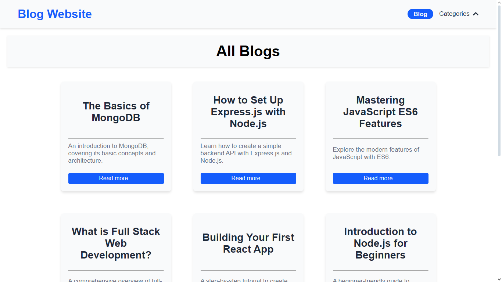
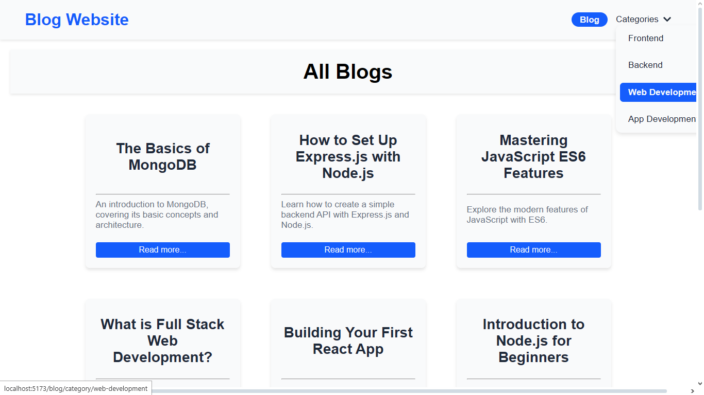
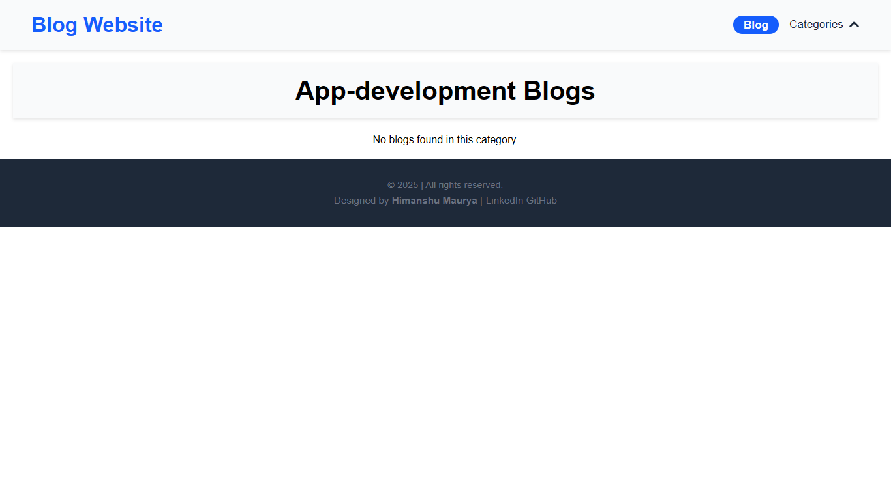
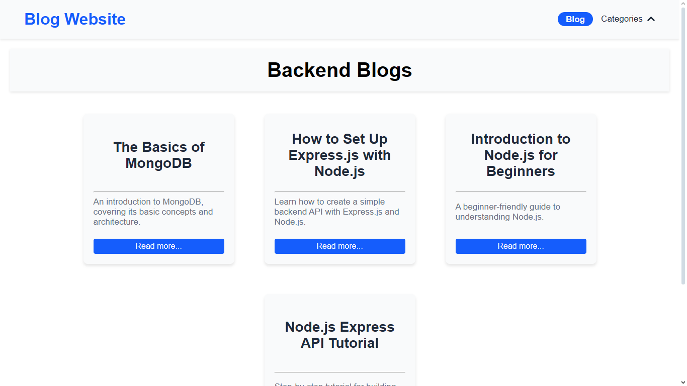
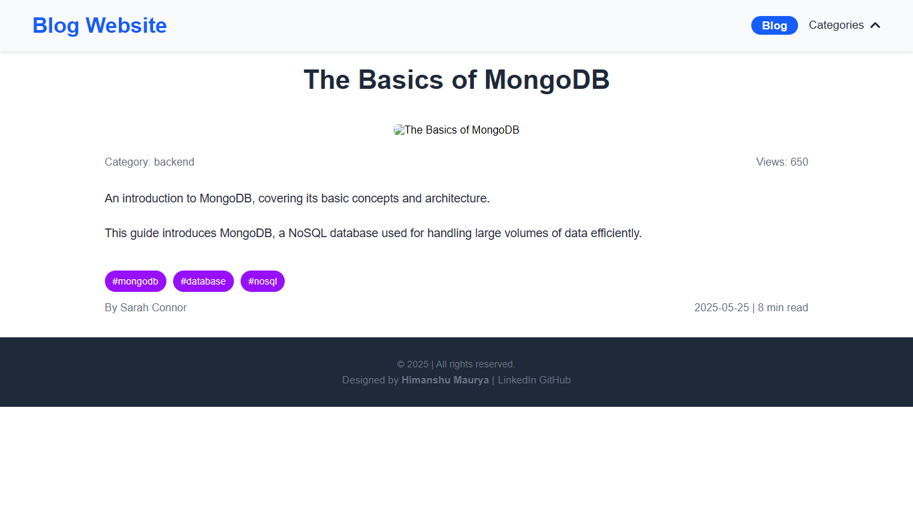
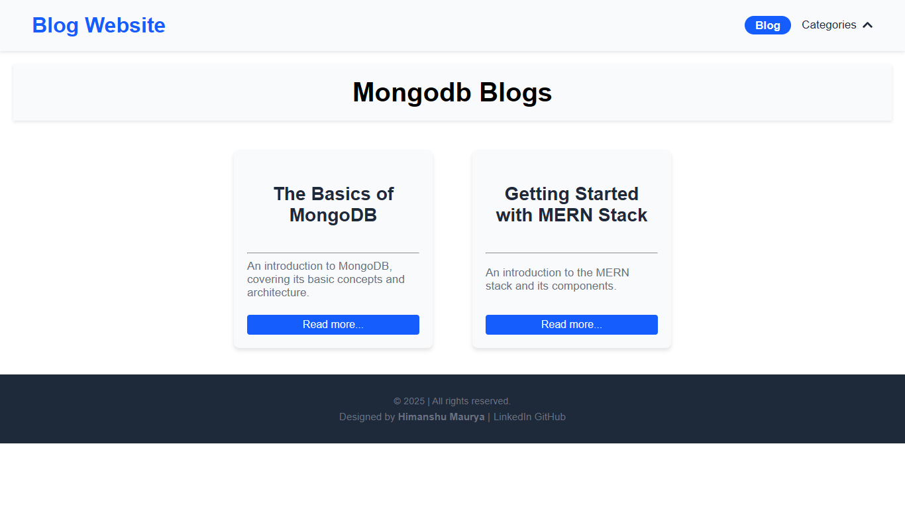
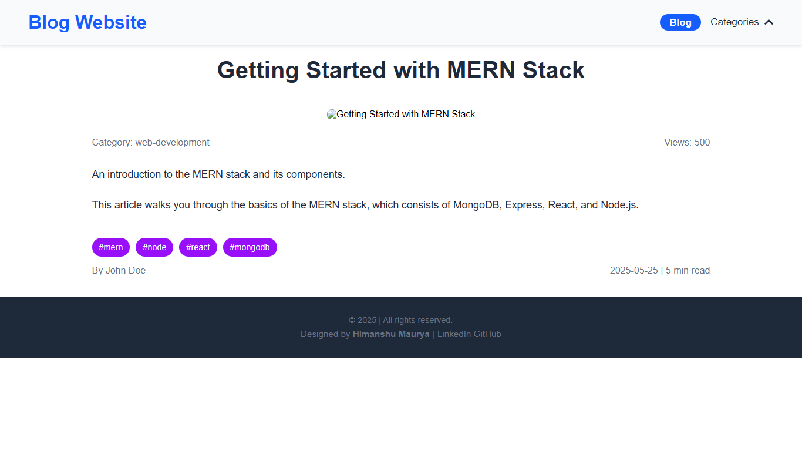
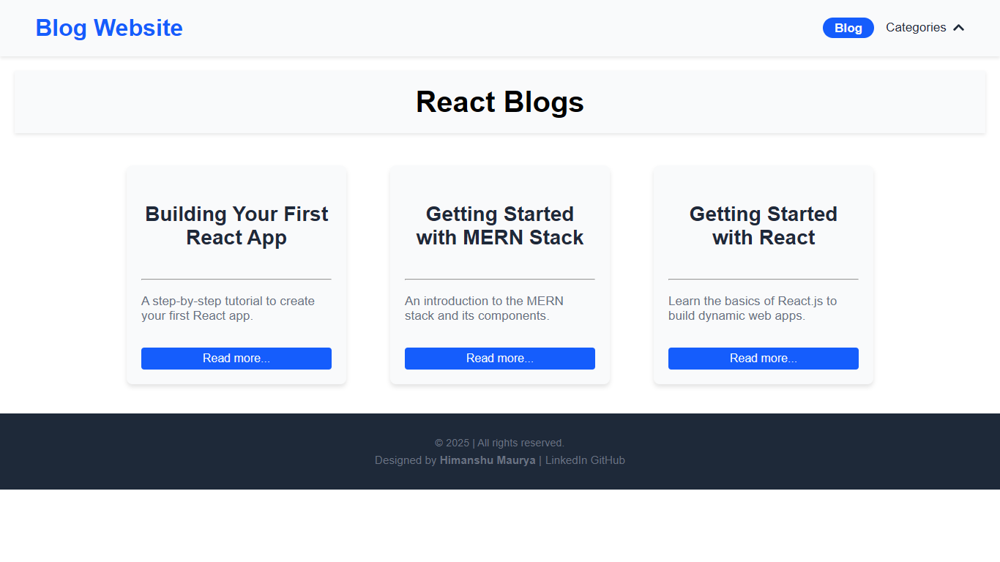

# MERN Stack - Blog Website

A dynamic and responsive **Blog Website** built using the **MERN stack (MongoDB, Express, React, Node.js)**. This project showcases full-stack development with blog creation, category filtering, tagging, and an interactive UI. It emphasizes modular design, clean architecture, and scalable routing logic for both client and server.

## 🧠 Features

- 📄 Display blog posts by category and tag

- 🔍 Modular components for blogs, layout, and UI

- 📦 RESTful API with Express and MongoDB

- ⚙️ Error handling middleware and database seeding

- 📱 Fully responsive and clean UI

- 🚀 Built with modern tooling: Vite, ESLint

## 📁 Project Structure

```bash
mern-blog-website/
├── client/                     # React frontend
│   ├── public/                 # Static assets
│   ├── src/
│   │   ├── assets/             # Images and icons
│   │   ├── components/         # Reusable UI components
│   │   ├── pages/              # Route-based views
│   │   ├── services/api.js     # Axios API calls
│   │   ├── App.jsx             # Main App logic
│   │   ├── main.jsx            # App entry point
│   │   └── index.css           # Global styles
│   ├── package.json
│   └── vite.config.js
└── server/                     # Express backend
    ├── config/db.js            # MongoDB connection logic
    ├── controllers/            # Blog controller
    ├── models/Blog.js          # Mongoose schema
    ├── routes/blogRoutes.js    # Express routes
    ├── middlewares/            # Custom error handling
    ├── data/seed.js            # Initial blog data
    ├── server.js               # App entry point
    ├── app.js                  # Server setup
    └── package.json
```

## 🚀 Getting Started

### 1. Clone the Repository

```bash
git clone https://github.com/himanshumaurya0007/MERN_Projects.git
cd MERN_Projects/blog-website
```

### 2. Start the Server

```bash
cd server
npm install
node data/seed.js
node server.js
```

### 3. Start the Client (In another terminal)

```bash
cd client
npm install
npm run dev
```

Now the app should be running at: `http://localhost:5173/blog`.

## 🛠️ Technologies Used

### Frontend

- React 19

- Vite 6

- JSX + CSS Modules

- Axios for API calls

- ESLint for code formatting

### Backend

- Node.js

- Express.js

- MongoDB with Mongoose

- dotenv for environment configuration

- REST API design

## 🎨 UI Highlights

- 📰 Blog Cards with tag/category indicators

- 🌐 Responsive layout with flexbox and media queries

- 🔁 Dynamic routing using React Router

- ⚙️ Controlled API interaction via services/api.js

- 🧩 Organized component-based structure for scalability

## 📸 Screenshots

- Display all blogs


- Dropdown menu and hover effect


- Web development category blogs


- No blogs within a specific category (App Development)


- Backend category blogs


- Basics of mongodb - blogpost


- mongodb - tag blogs


- mern stack - blogpost


- react - tag blogs


## 🔧 Future Improvements

- User authentication & dashboard

- Blog create/edit/delete (CRUD) functionality

- Rich text editor for blog content

- Pagination and search

- SEO optimization for blogs

## 📜 License

This project is licensed under the MIT License.

## 🙋‍♂️ Author

**Himanshu Maurya** - *Full-stack MERN Developer*

📍 Badlapur, Mumbai, India

🏆 Winner – HackWave Hackathon 2024

📧 [himanshumaurya7781@gmail.com](mailto:himanshumaurya7781@gmail.com)

🔗 [LinkedIn](www.linkedin.com/in/himanshumaurya0007)

## 📘 Learnings

- Built a full-stack project with the MERN stack

- Understood routing patterns in both Express and React

- Practiced API integration and error handling

- Designed responsive, modular UI with reusable components

- Applied clean separation of concerns across backend and frontend
