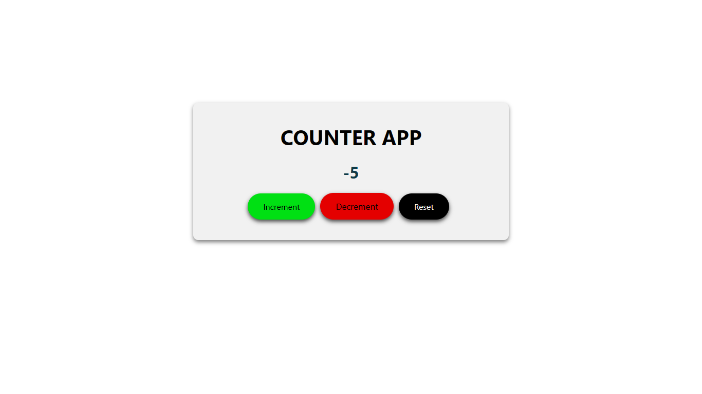
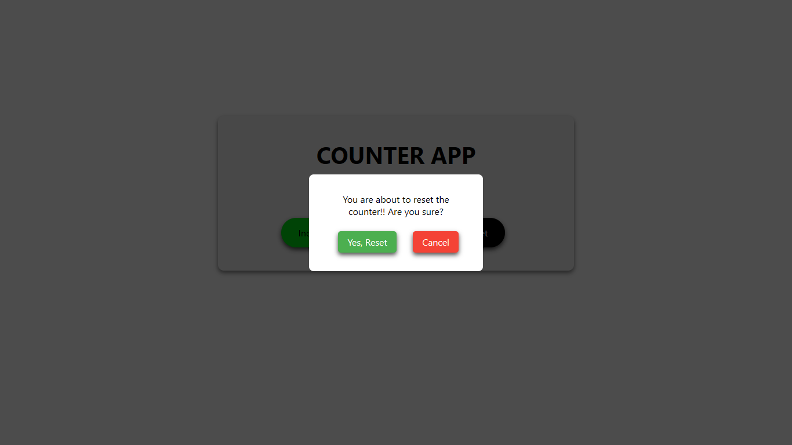

# React - Counter App

A clean, interactive **React 19** counter application built using **Vite 6**. It demonstrates fundamental concepts of React state management with useState, conditional rendering for modals, and responsive design with modern **CSS**.

## 🧠 Features

- Simple counter functionality with increment, decrement, and reset

- Confirmation modal before reset to avoid accidental zeroing

- Responsive design

- State-driven UI updates using React hooks

- Custom modal component with accessible layout

- Optimized dev setup using Vite and ESLint

## 📁 Project Structure

```bash
counter-app/
├── public/
├── src/
│   ├── App.css          # Main component styles
│   ├── App.jsx          # App logic with counter
│   ├── index.css        # Global styles
│   ├── main.jsx         # App entry point
│   ├── Modal.jsx        # Modal component
│   └── Modal.css        # Modal styles
├── index.html
├── package.json
└── vite.config.js
```

## 🚀 Getting Started

### 1. Clone the Repo

```bash
git clone https://github.com/himanshumaurya0007/MERN_Projects.git
cd MERN_Projects/counter-app
```

### 2. Install Dependencies

```bash
npm install
```

### 3. Start the Development Server

```bash
npm run dev
```

Now the app should be running at: `http://localhost:5173`.

## 🛠️ Technologies Used

- React 19

- Vite 6

- CSS Flexbox & Media Queries

- ESLint for code quality

- React Hooks (useState)

## 🎨 UI Highlights

- 🧾 Minimalistic design using pure CSS

- 📱 Fully responsive for mobile, tablet, and desktop

- ⚠️ Modal confirmation on reset button click

- 💡 Interactive feedback with hover animations and shadows

## 💻 Sample Code Snippet

```bash
const [count, setCount] = useState(0);
const [showModal, setShowModal] = useState(false);

const reset = () => setShowModal(true);
const confirmReset = () => {
  setCount(0);
  setShowModal(false);
};
```

## 📸 Screenshots

- UI


- Increment


- Decrement


- Reset (Alert)


## 📌 Future Improvements

- Keyboard accessibility for modal

- Sound feedback on button actions

- Add dark mode toggle

- Add unit tests with React Testing Library

## 📜 License

This project is licensed under the MIT License.

## 🙋‍♂️ Author

**Himanshu Maurya** - *Full-stack MERN Developer*

📍 Badlapur, Mumbai, India

🏆 Winner – HackWave Hackathon 2024

📧 [himanshumaurya7781@gmail.com](mailto:himanshumaurya7781@gmail.com)

🔗 [LinkedIn](www.linkedin.com/in/himanshumaurya0007)

## 🧠 Learnings

- Deepened understanding of React state and component logic

- Applied modular CSS techniques and responsiveness

- Practiced clean code structure and component reusability
