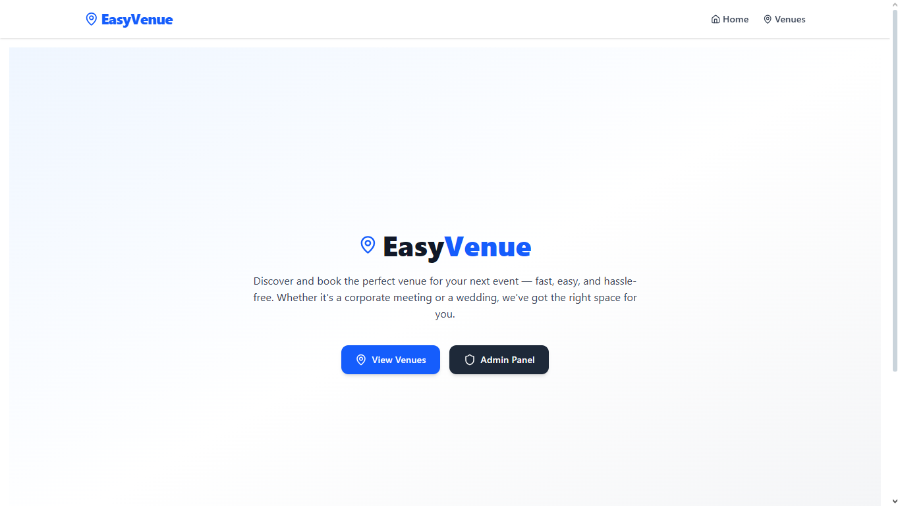
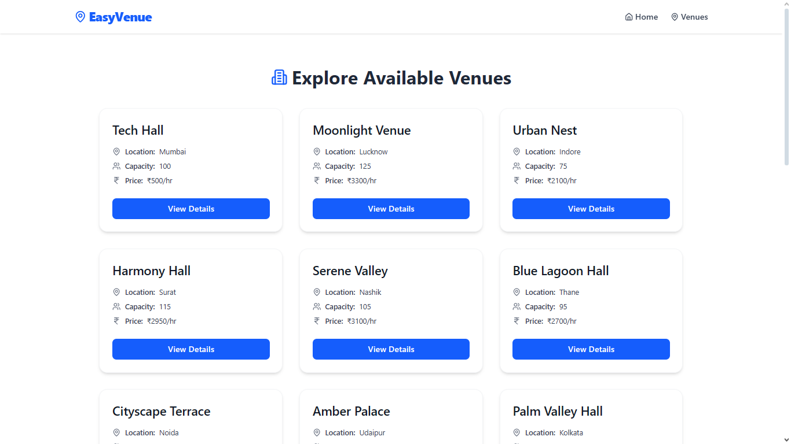
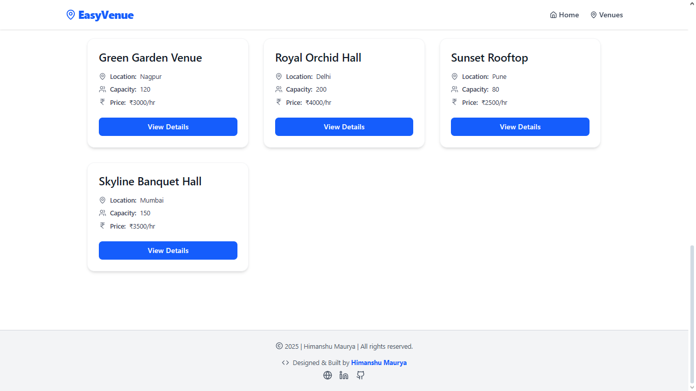
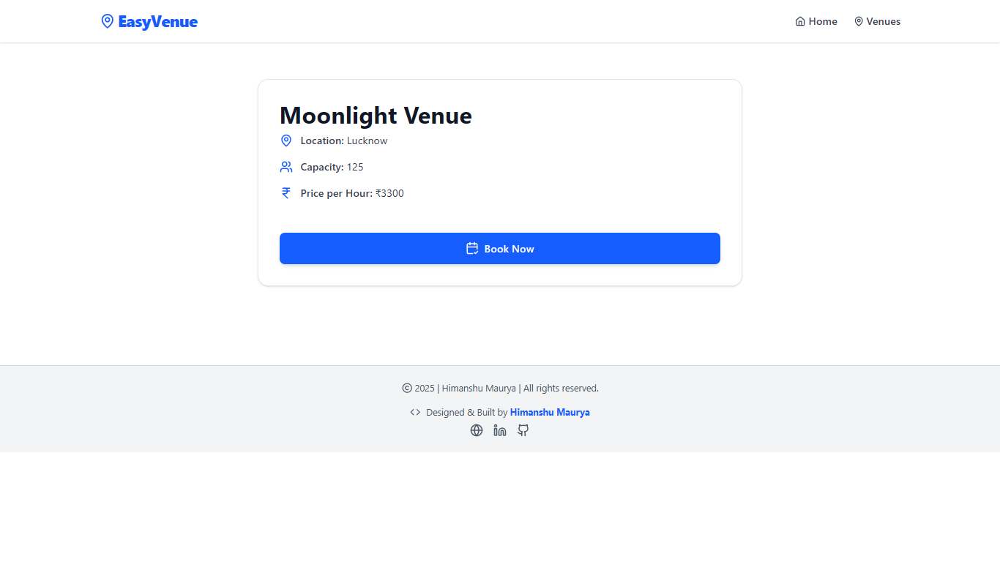
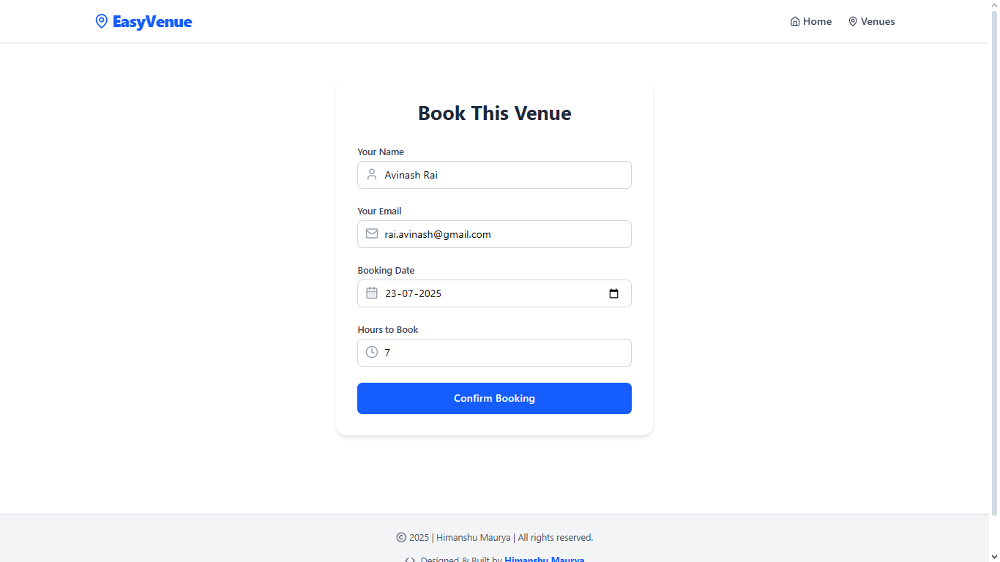
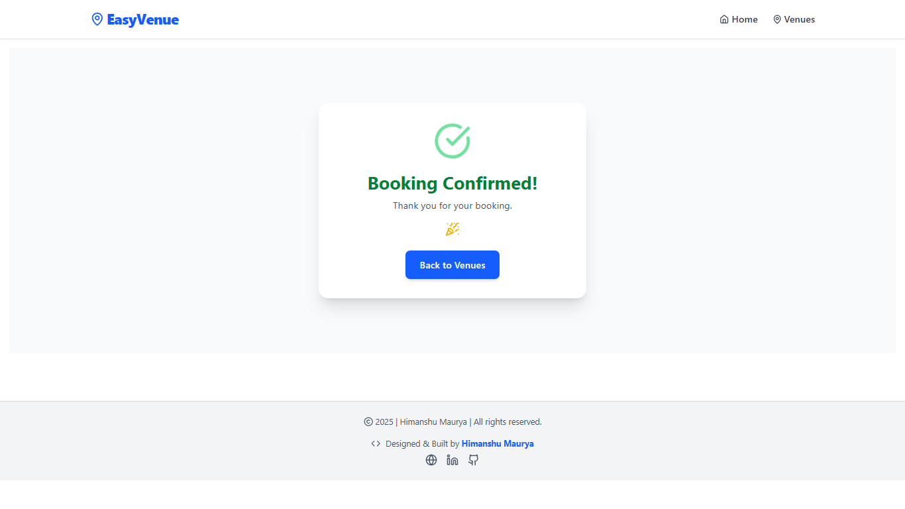
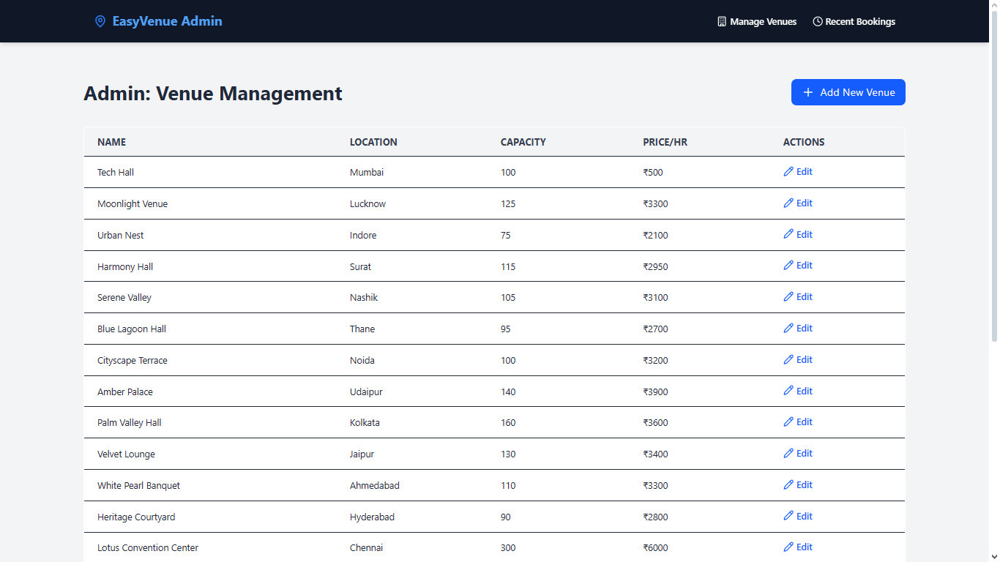
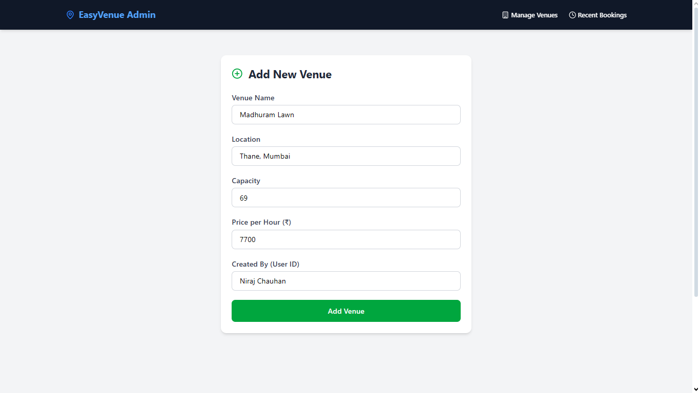
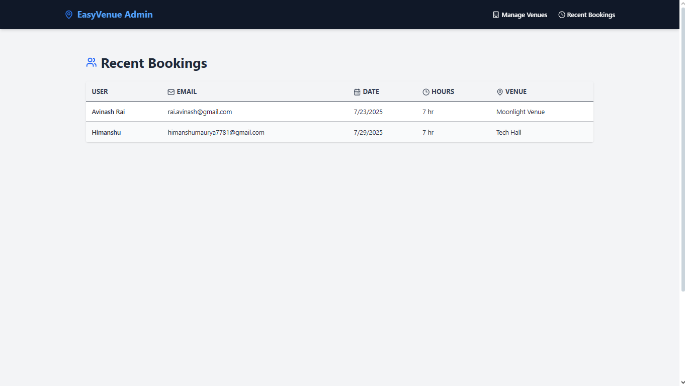
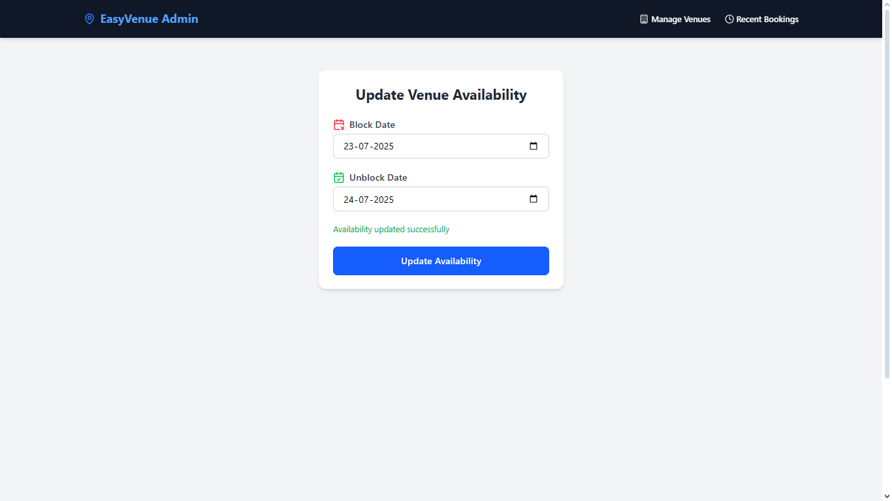

# Eazyvenue - Mini Venue Booking Dashboard

A full-stack web application built for **venue owners and users** to manage and book event spaces. Designed and implemented as part of the Eazyvenue.com hiring process with scalable architecture, modular codebase, and RESTful API best practices.

## 🚀 Features

### 🛠️ Admin (Venue Owners)

- Add new venues with venue name, location, capacity, and pricing details.

- Mark dates as unavailable (e.g., for offline bookings).

- View listed of venues with control over availability.

- View recent bookings.

### 👥 User (Public)

- Browse available venues with details.

- Book a venue for specific dates by filling form which includes users name, email, booking date, and how many hours to book the venue for.

## 📁 Project Structure

```bash
easyvenue/
├── backend/              # Node.js, Express, MongoDB
│ ├── models/
│ ├── controllers/
│ ├── routes/
│ ├── validations/
│ ├── middlewares/
│ └── server.js
└── frontend/             # React, Vite, Tailwind CSS
  ├── pages/
  ├── components/
  ├── layouts/
  ├── services/
  └── App.jsx
```

<!-- ## 🔗 Live Demo -->

<!-- 🌐 [Click here to view the deployed app](https://esayvenue-frontend.vercel.app) -->

## 📦 Tech Stack

### 🧠 Frontend

| Tech / Library               | Purpose                                                                                                            |
| ---------------------------- | ------------------------------------------------------------------------------------------------------------------ |
| **React 19**                 | Core library for building UI                                                                                       |
| **Vite**                     | Fast dev server and build tool                                                                                     |
| **React Router DOM v7**      | Client-side routing                                                                                                |
| **@tanstack/react-query v5** | Data fetching and caching                                                                                          |
| **Axios**                    | Promise-based HTTP client                                                                                          |
| **Tailwind CSS v4**          | Utility-first CSS framework                                                                                        |
| **Lucide React**             | Icon set used in the UI                                                                                            |

### 🔧 Backend

| Tech / Library        | Purpose                             |
| --------------------- | ----------------------------------- |
| **Node.js**           | JavaScript runtime                  |
| **Express 5**         | Web server framework                |
| **Mongoose 8**        | ODM for MongoDB                     |
| **Joi 17**            | Input/data validation               |
| **dotenv**            | Environment variable management     |
| **http-status-codes** | HTTP status constants               |
| **CORS**              | Cross-Origin Resource Sharing setup |
| **nodemon** (dev)     | Auto-reloading during development   |

## 📌 API Endpoints

### 🔍 Venue Routes

| Method | Endpoint                         | Description                        |
|--------|----------------------------------|------------------------------------|
| GET    | `/api/venues`                    | List all venues                    |
| GET    | `/api/venues/:id`                | Get venue details                  |
| POST   | `/api/venues`                    | Create a new venue (Admin)         |
| PATCH  | `/api/venues/:id/block-dates`    | Update venue availability          |

### 📅 Booking Routes

| Method | Endpoint                   | Description                        |
|--------|-----------------------------|------------------------------------|
| POST   | `/api/bookings`            | Book a venue (with availability check) |
| GET    | `/api/bookings/:venueId`   | Get bookings for a venue (admin)   |

## 📌 API Endpoints (Mapped to Frontend Routes)

- 🧑‍💼 Public/User Routes (PublicLayout)

| **Frontend Route**       | **Component**    | **Required API Endpoint(s)**                                                                   | **HTTP Method(s)**  |
| ------------------------ | ---------------- | ---------------------------------------------------------------------------------------------- | ------------------- |
| `/`                      | `HomePage`       | `GET /api/venues` *(featured/latest)*                                                          | `GET`               |
| `/venues`                | `VenueList`      | `GET /api/venues` *(list all venues)*                                                          | `GET`               |
| `/venues/:venueId`       | `VenueDetails`   | `GET /api/venues/:id` *(get details of a single venue)*                                        | `GET`               |
| `/book/:venueId`         | `BookingForm`    | `POST /api/bookings` *(submit booking request)*<br>`GET /api/venues/:id` *(for venue details)* | `GET`, `POST`       |
| `/book/:venueId/confirm` | `BookingSuccess` | (Optional fetch/confirmation display)                                                          | `GET` *(if needed)* |

- 🛠️ Admin Routes (AdminLayout)

| **Frontend Route**               | **Component**      | **Required API Endpoint(s)**                                                                                     | **HTTP Method(s)** |
| -------------------------------- | ------------------ | ---------------------------------------------------------------------------------------------------------------- | ------------------ |
| `/admin/venues`                  | `AdminVenueList`   | `GET /api/venues` *(admin list view)*                                                                            | `GET`              |
| `/admin/venues/new`              | `AddVenueForm`     | `POST /api/venues` *(create new venue)*                                                                          | `POST`             |
| `/admin/venues/:id/availability` | `AvailabilityForm` | `PATCH /api/venues/:id/block-dates` *(update blocked/unavailable dates)*<br>`GET /api/venues/:id` *(venue info)* | `GET`, `PATCH`     |
| `/admin/bookings/recent`         | `RecentBookings`   | `GET /api/bookings/:venueId` *(get recent bookings per venue)*                                                   | `GET`              |

## 🧪 How to Run Locally

### Clone the project locally

```bash
git clone https://github.com/himanshumaurya0007/MERN_Projects.git
cd MERN_Projects/easyvenue
```

### 📦 Backend Setup

```bash
cd backend
npm install
# Create .env file with DB config (.env example provided)
node data/seed.js
npm run dev
```

### 🌐 Frontend Setup (In another terminal)

```bash
cd frontend
npm install
npm run dev
```

The frontend runs on `http://localhost:5173` and connects to the backend running on `http://localhost:5000`.

## 📸 Screenshots

- HomePage - Introduction to EasyVenue


- VenueList - List all venues


- VenueList (end) - List all venues


- VenueDetails - Get details of a single venue


- BookingForm - Submit booking request


- BookingSuccess - Confirmation display


- AdminVenueList - Admin venue list view


- AddVenueForm - Create new venue


- AdminVenueList (New Venue Added) - Admin venue list view


- RecentBookings - Get recent bookings per venue


- AvailabilityForm - Update blocked/unavailable dates


## 📃 Assumptions

- Venue owners are considered authenticated by default (no auth layer implemented in this demo).

- Date availability is based on exact match and assumes day-wise blocking.

- Deployment done using Vercel (frontend) and Railway (backend).

## 🧠 Ideation: Advanced Features (Future Enhancements)

### 🔍 1. Capturing User Search Activity

**Objective:** Understand user preferences and optimize venue recommendations.

**Approach:**

- Track and store user search inputs such as keywords, locations, capacity filters, and date selections in a SearchLogs collection.

- Analyze frequent queries and peak search periods.

- Feed insights into a recommendation engine to suggest venues based on popular trends or past user behavior.

### 📊 2. Admin Analytics Dashboard

**Objective:** Provide venue owners with actionable insights to improve engagement and bookings.

**Approach:**

- Integrate an analytics dashboard using libraries like Recharts or Chart.js.

- Key metrics:
  - Total bookings per venue

  - Monthly/weekly trends

  - Most blocked dates (offline bookings)

  - Top performing venues by views and conversions

- Use role-based access control (RBAC) to restrict dashboard visibility to admins and venue owners.

### 📅 3. Calendar View for Venue Availability

**Objective:** Enhance UX with a visual booking and availability interface.

**Approach:**

- Use libraries like FullCalendar, react-calendar, or react-big-calendar.

- For venue owners:

  - View and block unavailable dates interactively.

- For users:

  - See available dates before booking, avoiding trial-error.

- Sync calendar events with the unavailableDates field in the backend.

### 🔐 4. Basic Authentication (Admin & Venue Owners)

**Objective:** Secure the system and provide personalized experiences.

**Approach:**

- Implement JWT-based authentication with access tokens and refresh tokens.

- User roles:
  - Admin: Full access to all venue and user data.

  - Venue Owner: Access to only their own venues/bookings.

  - User: Can browse and book venues.

- Protect sensitive routes using middleware.

- Optionally, use OAuth (Google Sign-In) for faster onboarding.

## 🛠️ Improvements for Eazyvenue Website

After analyzing the current implementation of eazyvenue, I observed that several key features have already been effectively implemented, such as:

- A responsive booking calendar for users

- Well-structured venue categorization (by type, location, capacity)

- Social proof features like reviews and ratings per venue

**As per my experience, no major changes are needed at this time.**

The platform demonstrates a strong UX foundation and modern UI practices and aligns well with modern web standards..

### 🔧 Minor Suggestion: Calendar Date Range Restriction

---

One small improvement would be to restrict the booking calendar's date range. Currently, users can select dates infinitely into the future, which may lead to impractical or unrealistic bookings. To enhance booking logic and operational accuracy, I recommend limiting the booking window to:

- **3 months, 6 months, or a maximum of 1 year into the future**

This would align better with standard event planning cycles and improve venue availability management.

## 👨‍💻 Author

**Himanshu Maurya** - *Full-stack MERN Developer*

📍 Badlapur, Mumbai, India

🏆 Winner – HackWave Hackathon 2024

📧 [himanshumaurya7781@gmail.com](mailto:himanshumaurya7781@gmail.com)

🔗 [LinkedIn](www.linkedin.com/in/himanshumaurya0007)
