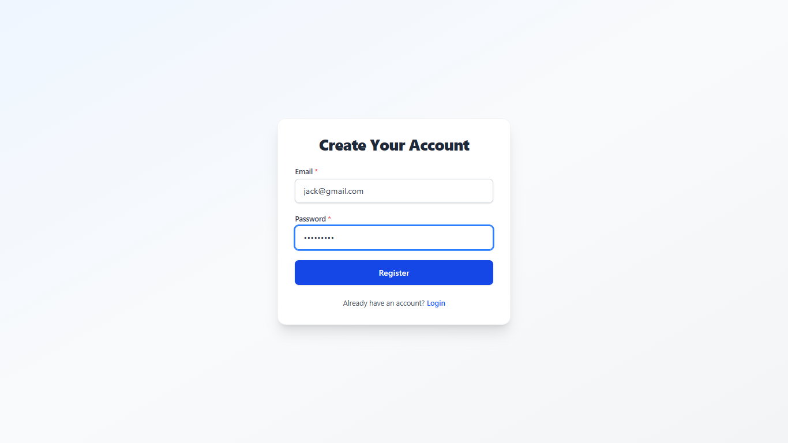
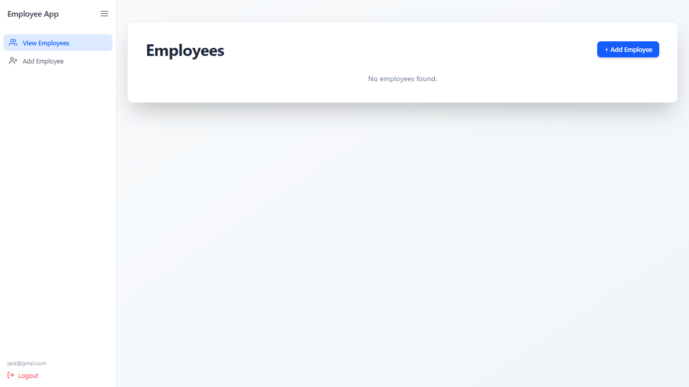
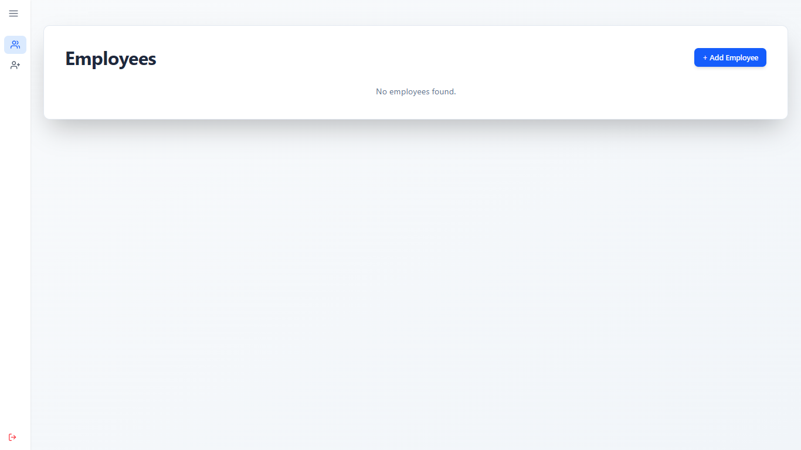
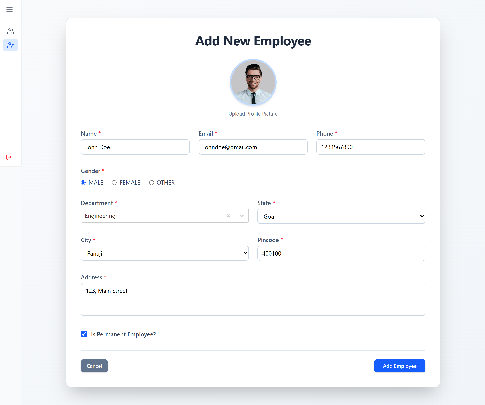
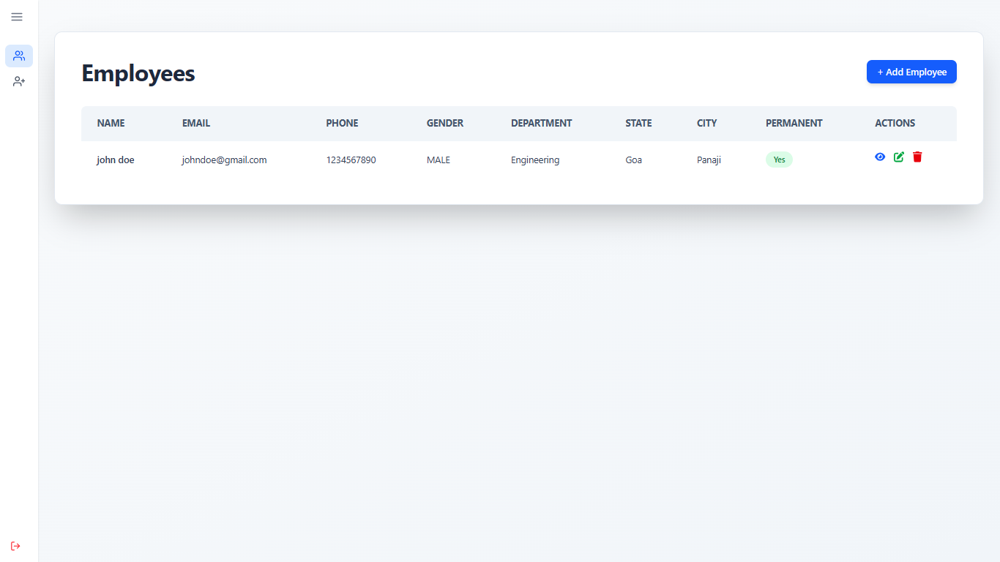
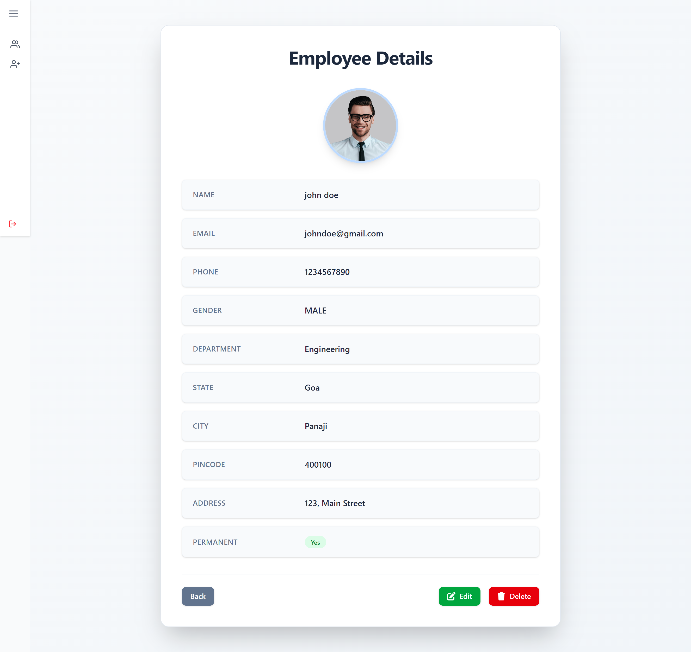
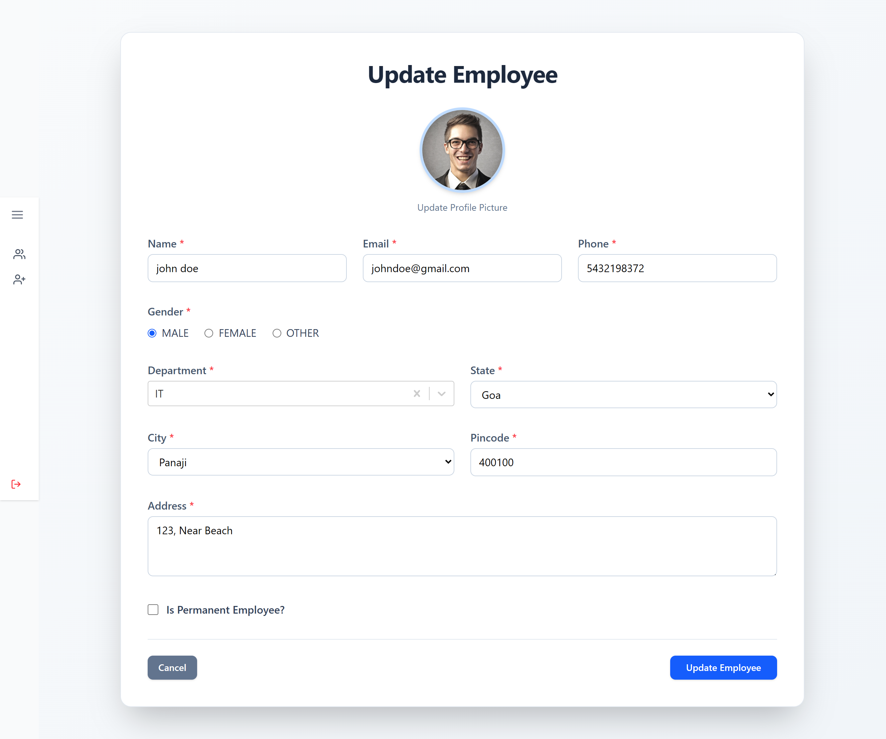
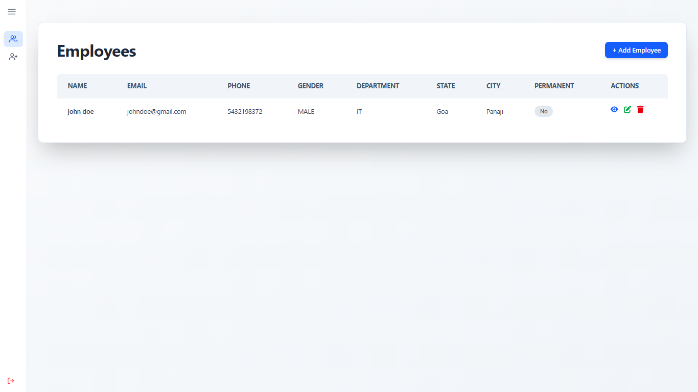
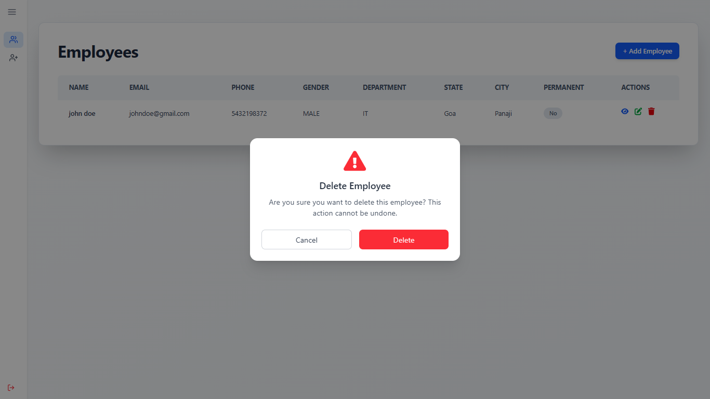

## Screenshots

- Register User

- Login User

- Dashboard

- Dashboard (Collapsable Sidebar)

- Add New Employee Form

- Add New Employee Successfully

- View Specific Employee Details

- Update Existing Employee Form

- Update Existing Employee Successfully

- Delete Employee - Confirmation Modal

