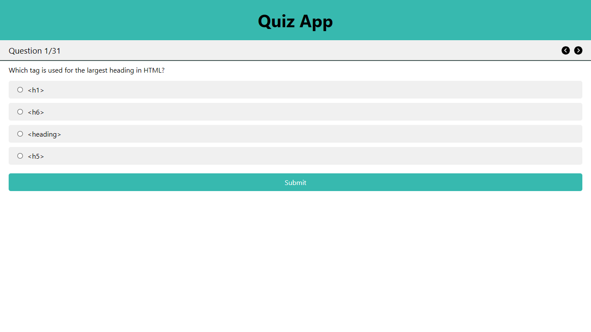
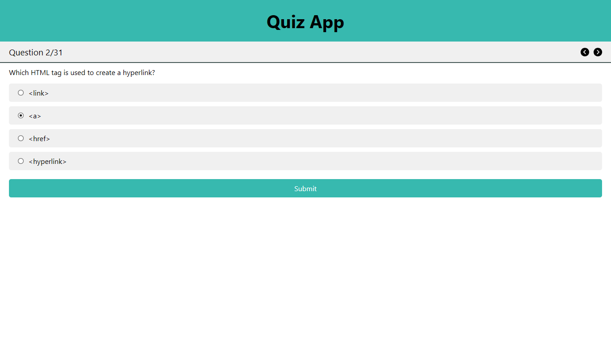
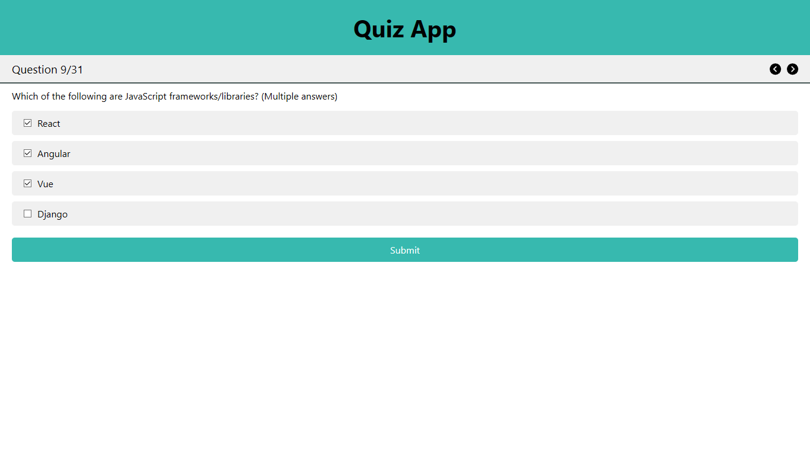
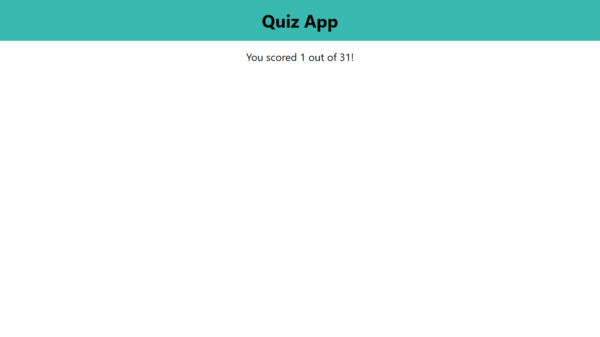

# React - Quiz App

A fully functional and interactive Quiz Application built with **React 19**, **Vite 6**, and **FontAwesome Icons**. This project tests knowledge across various web development domains (HTML, CSS, JavaScript, React, Node.js, etc.) with both single and multiple-choice questions. Users can navigate through questions, view scores, and enjoy a responsive design optimized for all devices.

## 🔍 Features

- React 19 + Vite 6 setup

- Multiple categories: HTML, CSS, JavaScript, Bootstrap, Tailwind, React, Node.js, MongoDB, and more

- Dynamic quiz logic:

  - Supports both single and multiple correct answers

  - Score tracking and display

  - Navigation through questions (Previous / Next)

- Responsive layout with custom styles

- FontAwesome Icons for navigation

- Clean UX with intuitive interaction

## 📁 Project Structure

```bash
quiz-app/
├── public/
├── src/
│   ├── App.css              # Component-specific styles
│   ├── App.jsx              # Main quiz logic and UI
│   ├── data.js              # All quiz questions and answers
│   ├── index.css            # Global styles
│   └── main.jsx             # Entry point
├── index.html               # Root HTML template
├── package.json             # Project metadata and dependencies
└── vite.config.js           # Vite configuration
```

## 🚀 Getting Started

### 1. Clone the repository

```bash
git clone https://github.com/himanshumaurya0007/MERN_Projects.git
cd MERN_Projects/quiz-app
```

### 2. Install dependencies

```bash
npm install
```

### 3. Start the development server

```bash
npm run dev
```

Your app will be live at: `http://localhost:5173`.

## 🛠️ Technologies Used

- React 19

- Vite 6

- FontAwesome Icons

## 🎮 Quiz Logic & Functionality

- Each question is rendered dynamically from a structured dataset.

- Supports:

  - Single-choice with radio buttons

  - Multiple-choice with checkboxes

- State management using `useState`:

  - Track current question

  - Track selected answers

  - Calculate score

- Navigation with **Previous / Next** buttons

- Icons from FontAwesome (`faCircleChevronLeft`, `faCircleChevronRight`)

- Final score displayed after the last question

## 📱 Responsive Design

- Fully mobile-friendly layout using flexbox and media queries
- Adjusts smoothly for screens smaller than 320px
- Styled with a clean and modern UI

## 📸 Screenshots

- UI


- Answer marking - (Radio button)  


- Question 2


- Question 9 - Multiple Choice Multiple Answer


- Result


## 📌 Future Scope

- Add timer functionality

- Persist score and answers with localStorage

- Category-wise quiz selection

- Dark mode support

- Integration with backend/database for storing user attempts

## 📜 License

This project is licensed under the MIT License.

## 🧑‍💻 Author

**Himanshu Maurya** - *Full-stack MERN Developer*

📍 Badlapur, Mumbai, India

🏆 Winner – HackWave Hackathon 2024

📧 [himanshumaurya7781@gmail.com](mailto:himanshumaurya7781@gmail.com)

🔗 [LinkedIn](www.linkedin.com/in/himanshumaurya0007)

## 🧠 Learnings

- Handling complex quiz logic (multi-answer questions, scoring)

- State-driven UI interactivity

- Responsive styling best practices

- React components, conditional rendering, and hooks
