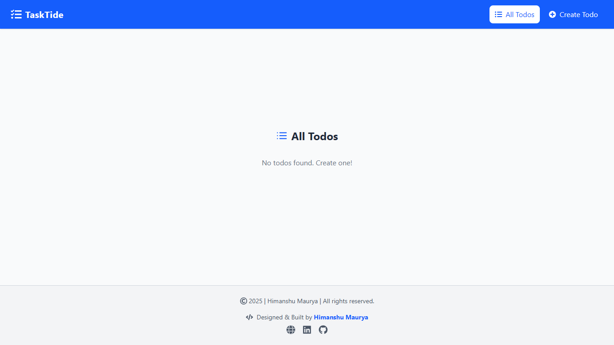
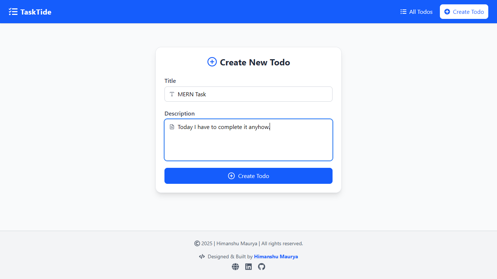
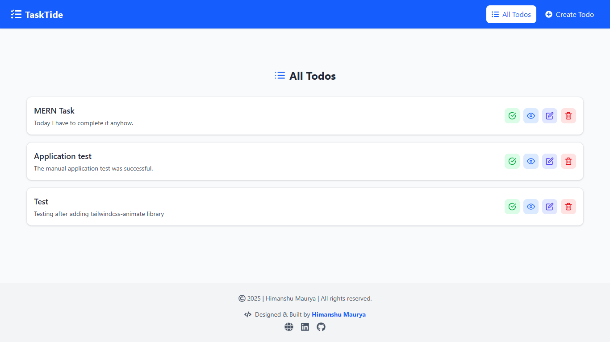
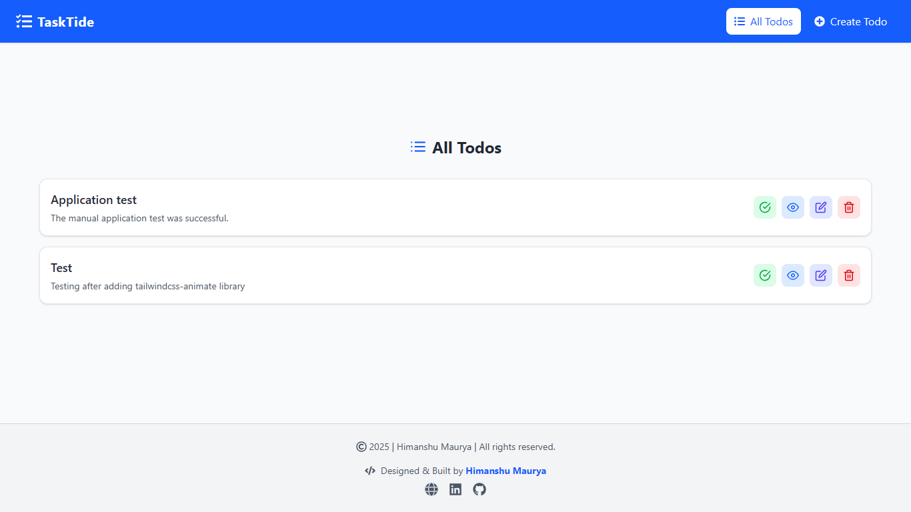
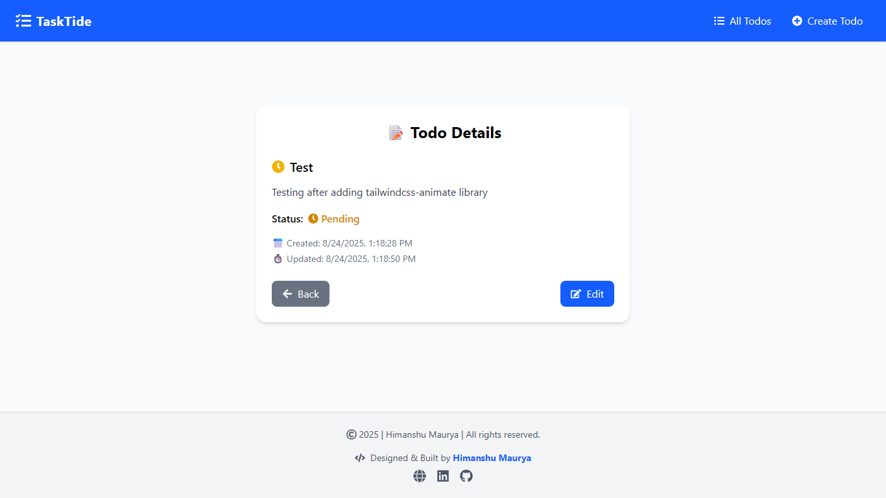
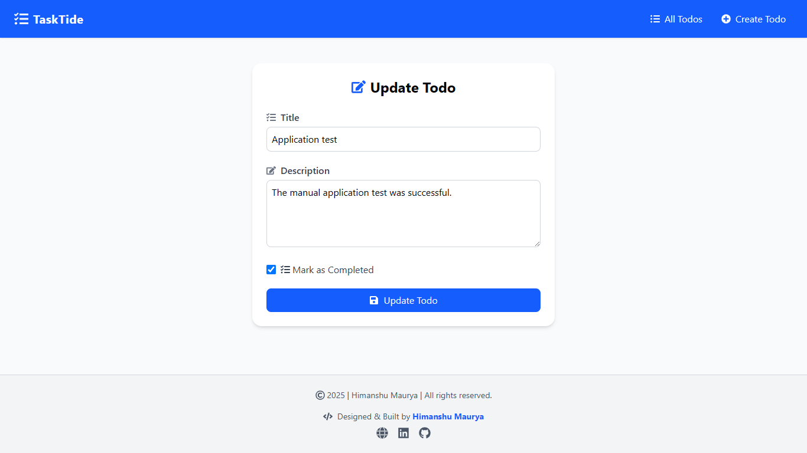
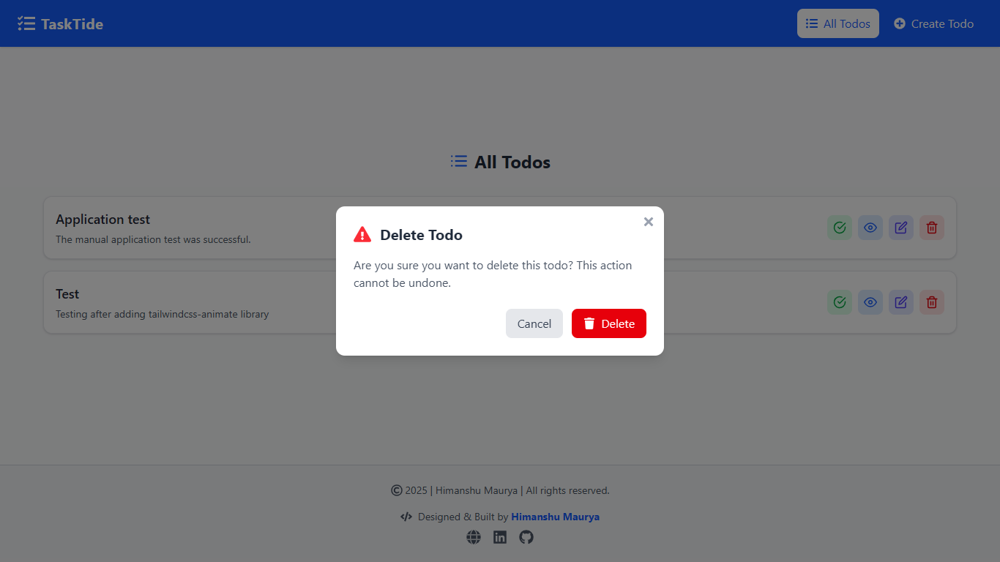

# TaskTide – To-Do Application

A full-stack To-Do management application built using the MERN stack (MongoDB, Express, React, Node.js).
This project demonstrates CRUD operations, RESTful API design, and a clean, responsive frontend using React and Tailwind CSS.
The system enables users to create, update, delete, and track daily tasks efficiently with a scalable architecture.

## 🧠 Features

- Create, edit, and delete tasks

- Mark tasks as complete or pending

- RESTful API with Express and MongoDB

- JWT-based authentication (optional, extendable)

- Responsive UI built with Tailwind CSS

- Modular, production-ready folder structure

- Data persistence using MongoDB

- Real-time UI updates with React state management

📁 Project Structure

```bash
mern-todo-app/
├── backend/                      # Express + MongoDB server
│   ├── src/
│   │   ├── config/               # Database configuration
│   │   │   └── db.js
│   │   ├── controllers/          # Business logic (Task controller)
│   │   ├── models/               # Mongoose models
│   │   │   └── Task.js
│   │   ├── routes/               # Express routes
│   │   │   └── taskRoutes.js
│   │   ├── middlewares/          # Error handling, JWT verification
│   │   ├── utils/                # Utility files
│   │   ├── app.js                # Express app setup
│   │   ├── constant.js           # Constant variables
│   │   └── server.js             # Entry point
│   ├── .env                      # Environment variables
│   ├── package.json
│   └── README.md
│
└── frontend/                     # React + Vite + Tailwind client
    ├── public/                   # Static assets
    ├── src/
    │   ├── components/           # Reusable components (TaskCard, Form, Header)
    │   ├── pages/                # Page views (Home, Completed, etc.)
    │   ├── services/       # Axios instance for API requests
    │   ├── App.jsx               # Main app component
    │   ├── main.jsx              # React entry point
    │   └── index.css             # Global styles
    ├── tailwind.config.js
    ├── vite.config.js
    └── package.json
```

## 🚀 Getting Started

### 1. Clone the Repository

```bash
git clone https://github.com/himanshumaurya0007/MERN_Projects.git
cd MERN_Projects/tasktide
```

### 2. Setup Backend

```bash
cd backend
npm install
```

Create a `.env` file inside `/backend` with:

```bash
PORT=5000
MONGO_URI=mongodb://localhost:27017
CORS_ORIGIN=*
```

Start the backend server:

```bash
npm run dev
```

The backend will start on: `http://localhost:5000`

### 3. Setup Frontend

Create a `.env` file inside `/frontend` with:

```bash
VITE_API_BASE_URL=http://localhost:5000/api/v1
```

Open another terminal:

```bash
cd frontend
npm install
npm run dev
```

The frontend will start on: `http://localhost:5173`

## 🧩 Core Functionality

| Feature               | Description                                   |
| --------------------- | --------------------------------------------- |
| ➕ Add Task           | Create new tasks via a form.                  |
| ✏️ Edit Task          | Update existing task title or description.    |
| ✅ Complete Task      | Mark tasks as done and filter completed ones. |
| 🗑️ Delete Task        | Permanently remove a task.                    |
| 🔄 Persistent Storage | All data stored in MongoDB Atlas.             |

## 🛠️ Technologies Used

🧠 Frontend

| Library / Tool         | Purpose                        |
| ---------------------- | ------------------------------ |
| **React 19**           | Component-based UI library     |
| **Vite 7**             | Fast build tool and dev server |
| **Tailwind CSS 4**     | Utility-first styling          |
| **Axios**              | HTTP client for API requests   |
| **React Router DOM 7** | Client-side routing            |
| **React Icons**        | Minimal, clean icons           |

⚙️ Backend

| Library / Tool        | Purpose                          |
| --------------------- | -------------------------------- |
| **Node.js 20+**       | Runtime environment              |
| **Express 5**         | REST API framework               |
| **Mongoose 8**        | ODM for MongoDB                  |
| **dotenv**            | Environment configuration        |
| **Joi 18**            | Request validation               |
| **bcryptjs**          | Password hashing (if auth added) |
| **jsonwebtoken**      | JWT-based authentication         |
| **http-status-codes** | Standard HTTP responses          |
| **CORS**              | Enable cross-origin requests     |

## 📱 UI Highlights

- Task cards with status indicators

- Clean, minimalistic layout

- Dynamic updates on create/delete/edit

- Centralized API layer

- Responsive design for mobile and desktop

## 📸 Screenshots

- Dashboard - Task List (Initially empty)


- Add New Task


- Add New Task Successful


- Dashboard - Task List


- Dashboard - Complete Task


- View specific task


- Edit Task


- Delete Task (Confirmation)


## 🔮 Future Enhancements

- User Authentication (Sign up / Login / Logout)

- Task statistics dashboard

- Due dates and reminders

- Dark mode support

- Search and tag-based filtering

- Integration with localStorage or service workers for offline mode

## 📜 License

This project is licensed under the MIT License.

## 👨‍💻 Author

**Himanshu Maurya** - *Full-stack MERN Developer*

📍 Badlapur, Mumbai, India

🏆 Winner – HackWave Hackathon 2024

📧 [himanshumaurya7781@gmail.com](mailto:himanshumaurya7781@gmail.com)

🔗 [LinkedIn](https://www.linkedin.com/in/himanshumaurya0007)

## 📘 Learnings

- Implemented full CRUD flow with MongoDB and Express

- Gained experience in RESTful API structuring

- Practiced Tailwind CSS for clean, responsive UI

- Enhanced state management and API integration in React

- Strengthened understanding of scalable MERN architecture
