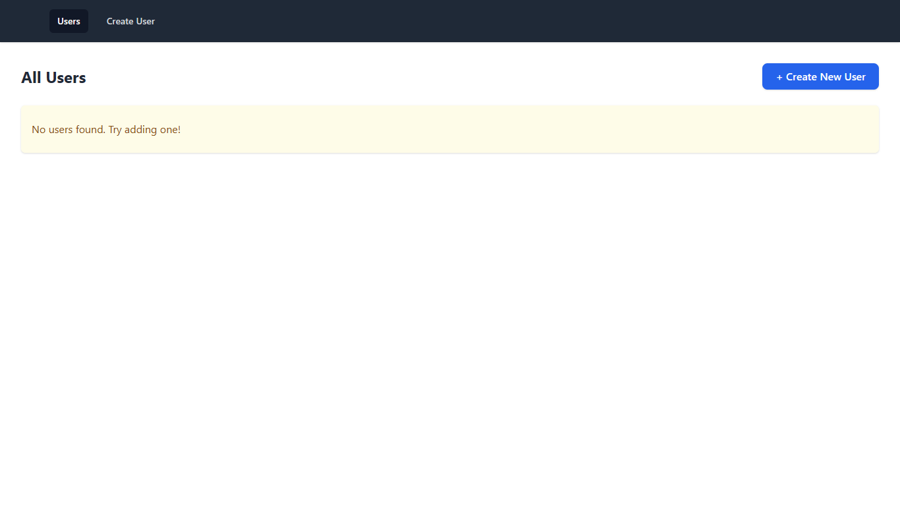
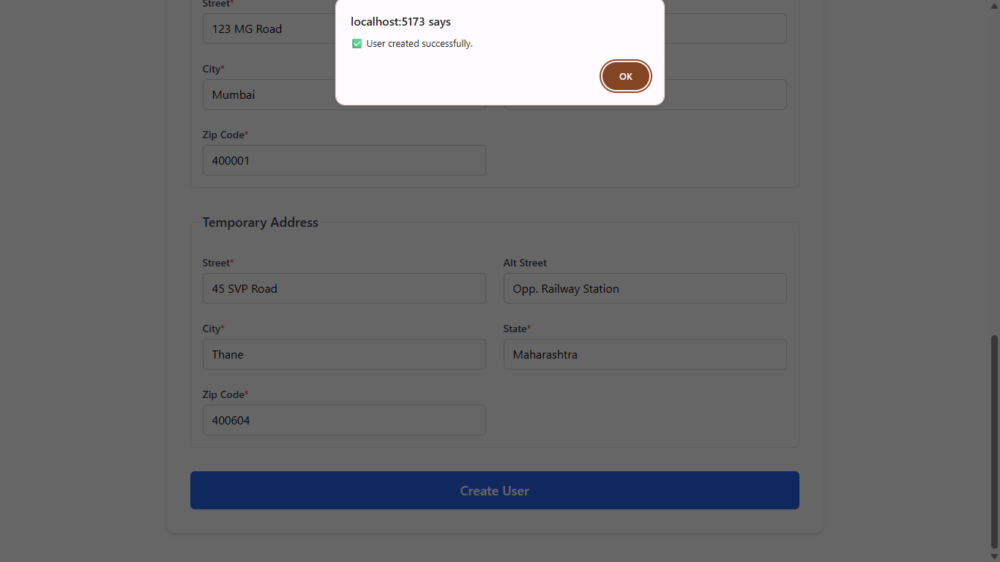
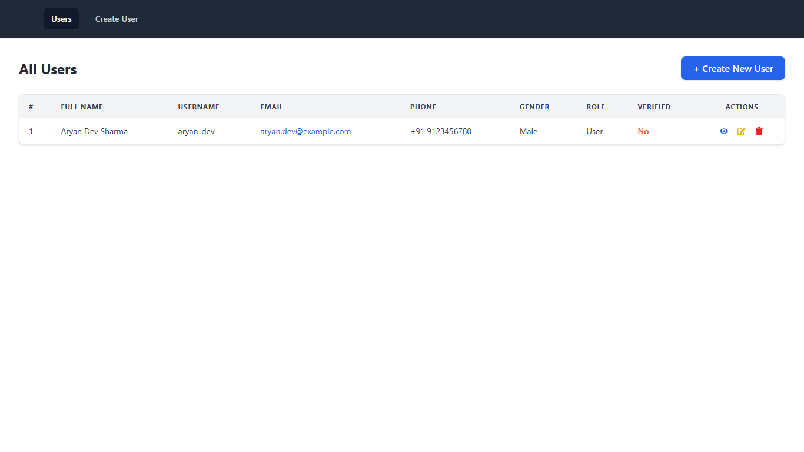
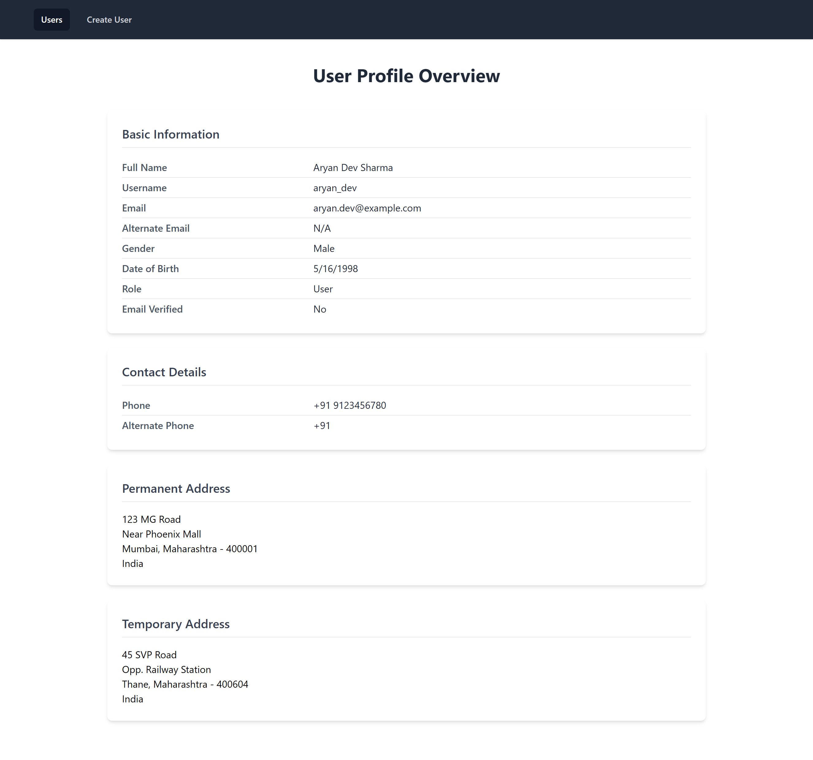
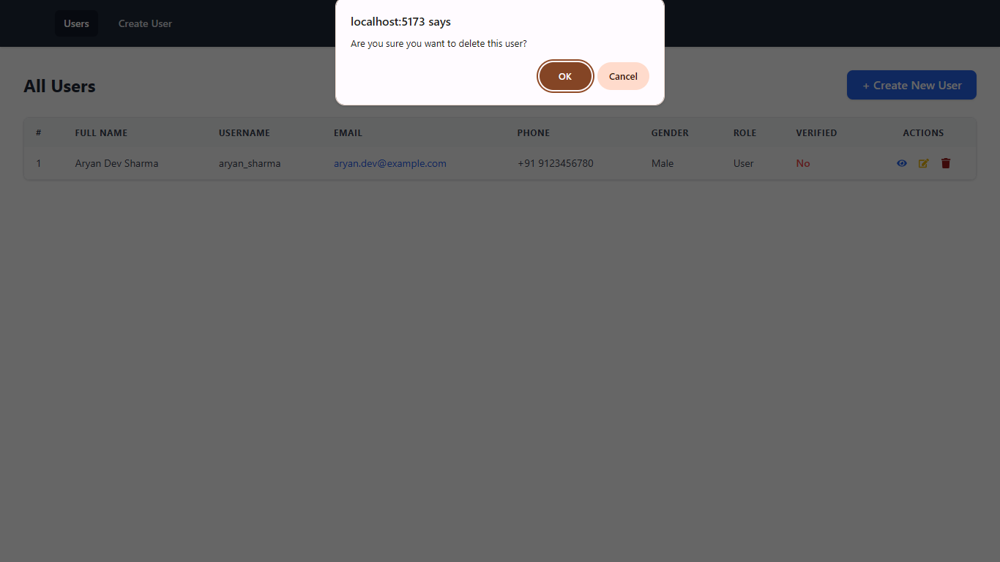

# 👥 User Management MERN Stack Application

A full-stack **User Management System** built using the **MERN stack (MongoDB, Express.js, React.js, Node.js)**. This application allows administrators to perform full CRUD operations on user data, handle routing across both backend and frontend, and manage stateful interactions with a clean and responsive UI.

## 🔍 Features

- 🧾 Add, update, delete, and list users
- 📁 RESTful API with clean controller-service separation

- 📦 MongoDB integration via Mongoose

- 🚦 React Router for client-side navigation

- 🎯 Modular code with scalable architecture

- 📱 Fully responsive layout using modern CSS techniques

## 🏗️ Project Structure

```
user-management-app/
├── frontend/                     # React frontend
│   ├── public/
│   ├── src/
│   │   ├── components/           # Reusable UI components
│   │   ├── pages/                # Route-based views (AddUser, EditUser, etc.)
│   │   ├── App.jsx               # Main component with routing
│   │   ├── main.jsx              # Entry point
│   │   └── index.css             # Global styles (Tailwind CSS)
│   ├── .env
│   ├── package.json
│   └── vite.config.js
├── backend/                      # Express backend
│   ├── src/
│   │    ├── config/              # MongoDB connection logic
│   │    ├── controllers/         # Controller logic
│   │    ├── models/              # Mongoose schema
│   │    ├── routes/              # Express routes
│   │    ├── app.js               # Express app configuration
│   │    └── server.js            # Server start script
│   └── .env
└── .gitignore
```

## 🚀 Getting Started

### 1. Clone the Repository

```bash
git clone https://github.com/himanshumaurya0007/MERN_Projects.git
cd MERN_Projects/user-management-app
```

### 2. Setup Backend

```bash
cd backend
npm install
```

🔑 Configure `.env`

```bash
MONGO_URI=mongodb://localhost:27017/user_management_db
PORT=5000
```

▶ Start Server (Development)
```bash
cd src
npm run dev
```

Server runs on: `http://localhost:5000`

### 3. Setup Frontend (In another terimnal)

```bash
cd frontend
npm install
```

▶ Start Client

```bash
npm run dev
```

App runs on: `http://localhost:5173/users`

## 🛠️ Technologies Used

### Frontend

- React 19

- Vite 6

- Axios

- React Router v7

- React Query

### Backend

- Node.js

- Express.js

- MongoDB with Mongoose

- dotenv for environment variables

- nodemon for dev reload

## 🎯 Key Functionalities

- Add User – Form with controlled inputs and validation

- Edit User – Pre-fills existing data with update support

- Delete User – Confirmation dialog before deletion

- User List – Table/grid view with dynamic loading

- Navigation – React Router based single-page experience

## 📸 Screenshots

- Dashboard - User List (Initially empty)


- Create and Add New User


- Dashboard - User List


- Specific user details


- Edit user details


- Delete existing user (Confirmation)


## 📌 Future Enhancements

- JWT-based authentication and authorization

- Role-based access control (admin/user)

- Pagination and filtering

- Toast notifications and error banners

- Integration with cloud MongoDB (Atlas)

## 📜 License

This project is licensed under the MIT License.

## 🙋‍♂️ Author

**Himanshu Maurya**<br>
📍 Badlapur, Mumbai, India<br>
🏆 Winner – HackWave Hackathon 2024

## 🧠 Learnings

- Built a complete CRUD system with proper routing and state management

- Designed RESTful APIs and followed MVC architecture

- Applied full-stack development principles using the MERN stack

- Practiced clean UI architecture with responsive design

- Learned to handle frontend-backend integration securely and modularly
